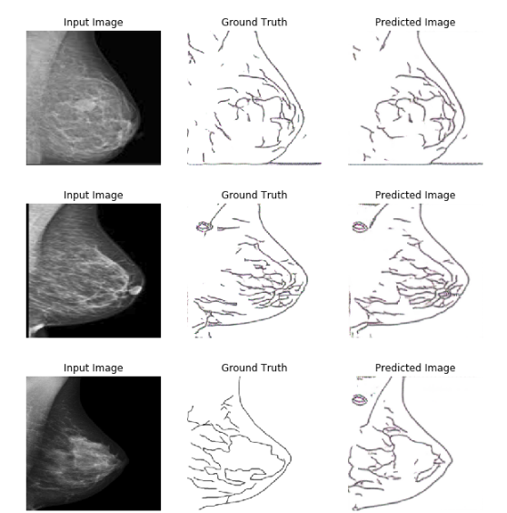
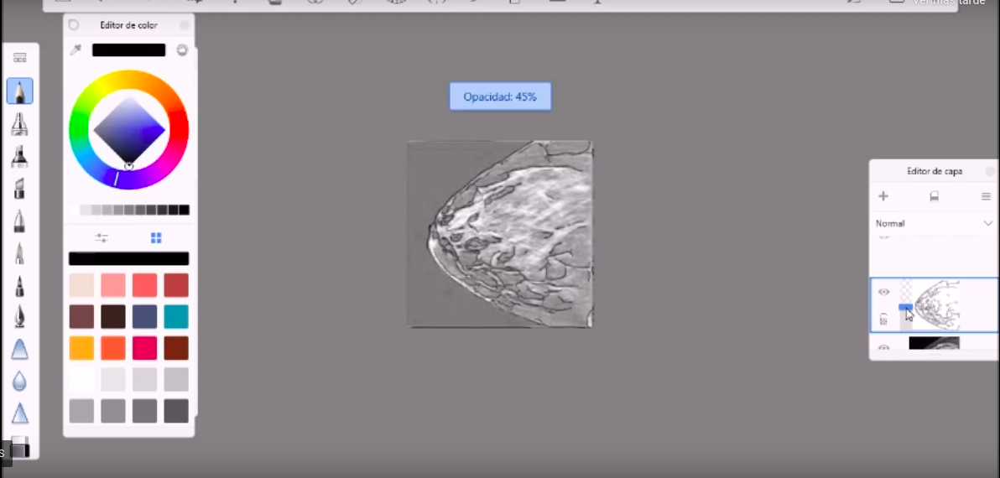
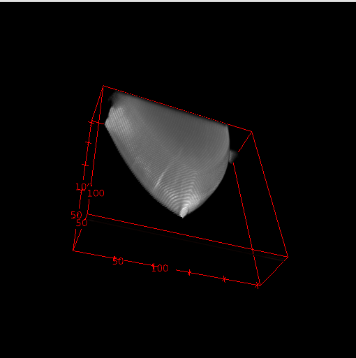
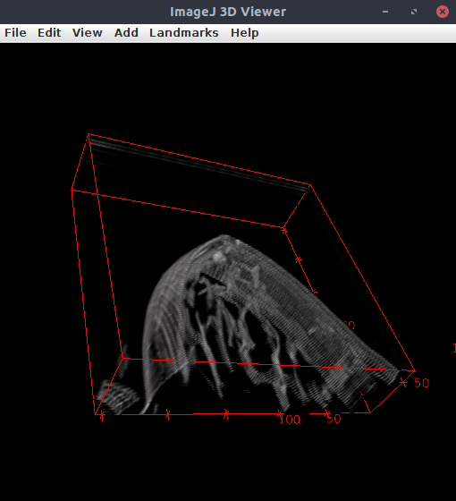

# Pixtopix para analisis de mamografias

En este proyecto se entrena la red pixtopix en dos sentidos con dos objetivos distintos pero muy importantes

## 1) Generar una mama realista a partir de un dibujo simple:

El primer objetivo busca encontrar una solución al problema de la poca disponiblidad de imagenes en medicina; por ejemplo para investigación es muy dificil poder acceder a dicha información y de poderse es muy común que nada de los procedimientos se puedan hacer públicos debido a la confidencialidad de los pacientes, entonces la trasmisión de conocimiento se ve bastante limitada y todo queda solo resumido a la publicación de los resultados, por dicha razón la pixtopix puede ser una excelente opción para generar material educativo y tambien para generar imagenes que despues pueden servir como data de entrenamiento para otro tipo de redes o problemas especificos.
 
## 2) Obtener un dibujo simple que represente las caracteristicas mas importantes de la mama a partir de una imagen realista de la misma: 

En el segundo objetivo se afronta uno de los mayores problemas a la hora de trabajar con estas imagenes, el cual es que aveces son dificiles de segmentar y de sustraer sus caracteristicas, lo que se vuelve una tarea muy complicada e incluso aveces imposible si no se cuenta con herramientas especiales, entonces la pixtopix es una buena opción para automatizar la sustracción de estas caracteristicas.

## Recolección de las imagenes

Para el entrenamiento de ambos modelos se utilizaron en total 524 imagenes todas ellas fueron recolectadas de google imagenes y baidú imagenes, buscando las palabras clave "tomosintesis", "mamografía" y "cancer de seno" en siete idiomas distintos; español, ingles,ruso,alemán,chino,japonés e hindú, despues de hacer la recoleción se procedió a delinear las caracteristicas a simple vista visibles con el software de dibujo autodesk sketchbook, es de recalcar tambien que algunas imágenes tuvieron que ser deformadas un poco para poderlas ajustar a los requerimientos de tamaño de la red, ademas como fueron recolectadas de diversas fuentes, tiene gran variabilidad en cuanto los efectos, la nitidez, la iluminación y las condiciones con que fueron tomadas, aún así se siguió adelante con el proceso, todo con la esperanza de que tanta variabilidad no resultara enmascarando a la red las caracteristicas de interes.

[Dar click para ver el video donde se expone el procedimiento para delinear las imagenes](https://youtu.be/-59jc6V7aNs)

## Ejemplos de aplicación

### vista de la mama sin segementar

### Vista de la mama segmentada

[Dar click para ver el código y el procedimiento detallado de como segmentar la mama](https://github.com/mandalarotation/Concurso_dotcsv_Proyecto_Mamografias/blob/master/Ejemplos/example_AtoB/example_tomosintesis.ipynb)

Por obvias razones de capacidad de alamacenamiento en github los modelos ya entrenandos no vienen directamente en el repositorio, [para cpnseguir ambos mdodelos entrenados ir al siguiente enlace de google drive y descargarlos ](https://drive.google.com/file/d/12bOJ5WMeZOCbBw6w0DDblljTDvXVLUdZ/view?usp=sharing).  Una vez descargados extraerlos y ubicarlos en la carpeta modelos entrenados, entonces siempre que se cargue un checkpoint en el código rectifar la dirección en la que quedó ubicado el modelo.

[Dar click para ver el video donde se expone el procedimiento para desarrollar los ejemplos y utilizar las redes entrenadas](https://youtu.be/oIyCk5IhObY)

